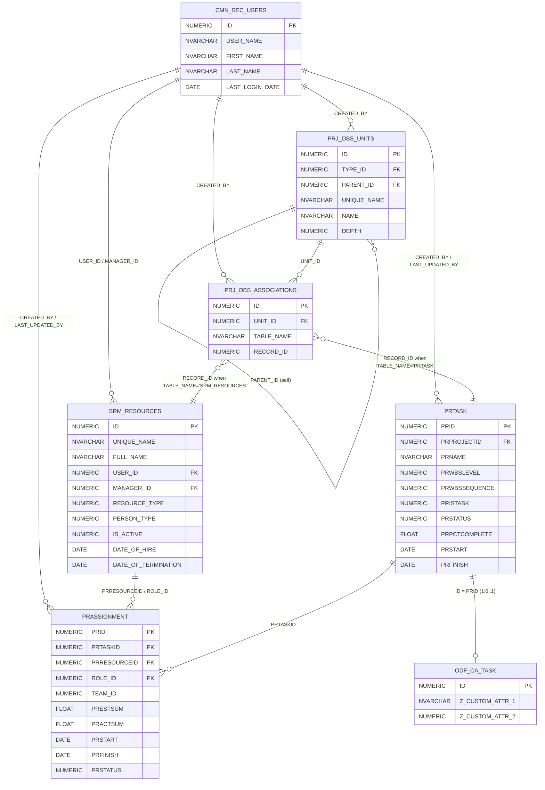

# SQL Practice — `SRM_RESOURCES`, `CMN_SEC_USERS`, `PRJ_OBS_UNITS`, `PRJ_OBS_ASSOCIATIONS`, `ODF_CA_TASK`, `PRTASK`, `PRASSIGNMENT`

> [!info] Goal
> Ten exercises, easy → hard, that walk you across the **resource → OBS → task → assignment** spine of Clarity.
> Each exercise has a problem, expected output shape, hints (with the common Clarity gotchas), and a collapsed solution. Try to write it yourself before opening the solution.

---

## Schema diagram (relationships used in these exercises)



> [!warning] Caveats baked into these exercises
> - **`CMN_SEC_USERS`** is a stub in the 16.4.1 dump — verify column names (`USER_NAME`, `FIRST_NAME`, `LAST_NAME`, `LAST_LOGIN_DATE`) against `INFORMATION_SCHEMA.COLUMNS` in your environment.
> - **`ODF_CA_TASK`** is also off-screen. Its PK `ID` equals `PRTASK.PRID`, and custom attribute columns are commonly prefixed `Z_…` — names depend on Studio config.
> - **`SRM_RESOURCES.MANAGER_ID`** points to `CMN_SEC_USERS.ID`, **not** `SRM_RESOURCES.ID`. Easy mistake.
> - **`PRTASK` columns have no underscore after `PR`**: `PRID`, `PRPROJECTID`, `PRNAME`, `PRWBSLEVEL`, `PRWBSSEQUENCE`, `PRISTASK`.
> - **Summary tasks** have `PRISTASK = 0`; **leaf tasks** have `PRISTASK = 1`. Every project has a hidden root summary.
> - **`PRJ_OBS_ASSOCIATIONS.TABLE_NAME`** is a string. Resources use `'SRM_RESOURCES'`; projects use `'SRM_PROJECTS'` (legacy view name) — case-sensitive.

---

## Exercise 1 — Active resources (Easy)

**Task.** List the `UNIQUE_NAME`, `FULL_NAME`, and `EMAIL` of every **active** resource, sorted by `FULL_NAME`.

**Concepts.** `SELECT`, `WHERE`, `ORDER BY`, the `IS_ACTIVE` flag.

> [!hint] Hint
> `IS_ACTIVE` is `NUMERIC NOT NULL` — `1` is active, `0` is not.

> [!success]- Solution
> ```sql
> SELECT  UNIQUE_NAME,
>         FULL_NAME,
>         EMAIL
> FROM    SRM_RESOURCES
> WHERE   IS_ACTIVE = 1
> ORDER   BY FULL_NAME;
> ```

---

## Exercise 2 — Resources joined to login users (Easy)

**Task.** For every active resource that has a login user, show the resource's `UNIQUE_NAME` / `FULL_NAME` and the user's `USER_NAME` / `LAST_LOGIN_DATE`. Resources **without** a login should not appear.

**Concepts.** `INNER JOIN`, the `SRM_RESOURCES.USER_ID → CMN_SEC_USERS.ID` link.

> [!hint] Hint
> `USER_ID` on `SRM_RESOURCES` is nullable — non-login resources have it `NULL`. An `INNER JOIN` filters them out automatically.

> [!success]- Solution
> ```sql
> SELECT  r.UNIQUE_NAME,
>         r.FULL_NAME,
>         u.USER_NAME,
>         u.LAST_LOGIN_DATE
> FROM    SRM_RESOURCES r
> JOIN    CMN_SEC_USERS u ON u.ID = r.USER_ID
> WHERE   r.IS_ACTIVE = 1
> ORDER   BY u.LAST_LOGIN_DATE DESC;
> ```

---

## Exercise 3 — Detail tasks of a project in WBS order (Easy/Medium)

**Task.** For project with `INV_INVESTMENTS.CODE = 'PR1001'` (substitute your own project code), list every **detail** task (no summaries) with its name, depth, scheduled dates, and percent complete, ordered by WBS sequence.

**Concepts.** Filtering on `PRISTASK = 1`, the `PRTASK → INV_INVESTMENTS` join via `PRPROJECTID`, ordering by `PRWBSSEQUENCE`.

> [!hint] Hint
> The hidden auto-created project root has `PRWBSLEVEL = 1` and `PRISTASK = 0`. Filter `PRISTASK = 1` to keep only leaf (detail) tasks.

> [!success]- Solution
> ```sql
> SELECT  t.PRID,
>         t.PRNAME,
>         t.PRWBSLEVEL,
>         t.PRSTART,
>         t.PRFINISH,
>         t.PRPCTCOMPLETE
> FROM    PRTASK          t
> JOIN    INV_INVESTMENTS i ON i.ID = t.PRPROJECTID
> WHERE   i.CODE      = 'PR1001'
>   AND   t.PRISTASK  = 1
> ORDER   BY t.PRWBSSEQUENCE;
> ```

---

## Exercise 4 — Every assignment for one resource (Medium)

**Task.** For resource `UNIQUE_NAME = 'jdoe'`, list every task they're assigned to: project code, task name, assignment dates, status, estimate (`PRESTSUM`) and actuals (`PRACTSUM`).

**Concepts.** Multi-table join `SRM_RESOURCES → PRASSIGNMENT → PRTASK → INV_INVESTMENTS`.

> [!hint] Hint
> `PRASSIGNMENT.PRRESOURCEID` joins to `SRM_RESOURCES.ID` (despite the column comment that says `PRRESOURCE.PRID` — that's legacy).

> [!success]- Solution
> ```sql
> SELECT  i.CODE                      AS project_code,
>         t.PRNAME                    AS task_name,
>         a.PRSTART, a.PRFINISH,
>         a.PRSTATUS,                 -- 0=NotStarted, 1=Started, 2=Completed
>         a.PRESTSUM,
>         a.PRACTSUM
> FROM    SRM_RESOURCES   r
> JOIN    PRASSIGNMENT    a ON a.PRRESOURCEID = r.ID
> JOIN    PRTASK          t ON t.PRID         = a.PRTASKID
> JOIN    INV_INVESTMENTS i ON i.ID           = t.PRPROJECTID
> WHERE   r.UNIQUE_NAME = 'jdoe'
> ORDER   BY i.CODE, t.PRWBSSEQUENCE;
> ```

---

## Exercise 5 — OBS tree with parent label (Medium)

**Task.** For OBS type with `PRJ_OBS_TYPES.UNIQUE_NAME = 'Department'`, list every unit's `UNIQUE_NAME`, `NAME`, `DEPTH`, and the **parent unit's `NAME`** (root nodes show `NULL` for parent). Sort by `DEPTH`, then by name.

**Concepts.** Self-join on `PRJ_OBS_UNITS` via `PARENT_ID`. `LEFT JOIN` so root nodes survive.

> [!hint] Hint
> Root nodes have `PARENT_ID IS NULL`. `LEFT JOIN` to a second alias of `PRJ_OBS_UNITS` keeps them.

> [!success]- Solution
> ```sql
> SELECT  c.UNIQUE_NAME      AS unit_code,
>         c.NAME             AS unit_name,
>         c.DEPTH,
>         p.NAME             AS parent_name
> FROM    PRJ_OBS_TYPES  ot
> JOIN    PRJ_OBS_UNITS  c  ON c.TYPE_ID = ot.ID
> LEFT    JOIN PRJ_OBS_UNITS p  ON p.ID  = c.PARENT_ID
> WHERE   ot.UNIQUE_NAME = 'Department'
> ORDER   BY c.DEPTH, c.NAME;
> ```

---

## Exercise 6 — Resources associated to one OBS unit (Medium)

**Task.** Find all resources directly associated with the `'Engineering'` unit of the `'Department'` OBS — return `UNIQUE_NAME`, `FULL_NAME`. Direct associations only (no descendants yet — that's Exercise 9).

**Concepts.** Polymorphic join through `PRJ_OBS_ASSOCIATIONS`. The `TABLE_NAME` column is a **string discriminator**.

> [!hint] Hint
> For resources, `PRJ_OBS_ASSOCIATIONS.TABLE_NAME = 'SRM_RESOURCES'` (case-sensitive). `RECORD_ID` is then `SRM_RESOURCES.ID`.

> [!success]- Solution
> ```sql
> SELECT  r.UNIQUE_NAME,
>         r.FULL_NAME
> FROM    PRJ_OBS_TYPES        ot
> JOIN    PRJ_OBS_UNITS        ou ON ou.TYPE_ID = ot.ID
> JOIN    PRJ_OBS_ASSOCIATIONS oa ON oa.UNIT_ID    = ou.ID
>                                AND oa.TABLE_NAME = 'SRM_RESOURCES'
> JOIN    SRM_RESOURCES        r  ON r.ID         = oa.RECORD_ID
> WHERE   ot.UNIQUE_NAME = 'Department'
>   AND   ou.UNIQUE_NAME = 'Engineering'
>   AND   r.IS_ACTIVE    = 1
> ORDER   BY r.FULL_NAME;
> ```

---

## Exercise 7 — Per-task workload aggregation (Medium/Hard)

**Task.** For project `CODE = 'PR1001'`, for each **detail** task return: task name, number of resources assigned, total `PRESTSUM`, total `PRACTSUM`, and a "% utilised" computed column (`PRACTSUM / NULLIF(PRESTSUM + PRACTSUM, 0) * 100`). Tasks with no assignments must still appear with zeroes / NULLs.

**Concepts.** `GROUP BY`, aggregates, `LEFT JOIN` to keep tasks with zero assignments, `NULLIF` to avoid divide-by-zero.

> [!hint] Hint
> `LEFT JOIN PRASSIGNMENT` then `GROUP BY` the task. `COUNT(a.PRID)` not `COUNT(*)` — `COUNT(*)` would never be 0 because of the outer-joined parent row.

> [!success]- Solution
> ```sql
> SELECT  t.PRID,
>         t.PRNAME,
>         COUNT(a.PRID)                                              AS resource_count,
>         COALESCE(SUM(a.PRESTSUM), 0)                               AS total_etc,
>         COALESCE(SUM(a.PRACTSUM), 0)                               AS total_actuals,
>         ROUND(
>           COALESCE(SUM(a.PRACTSUM), 0)
>             / NULLIF(COALESCE(SUM(a.PRESTSUM), 0)
>                    + COALESCE(SUM(a.PRACTSUM), 0), 0)
>             * 100, 2)                                              AS pct_utilised
> FROM    INV_INVESTMENTS i
> JOIN    PRTASK          t ON t.PRPROJECTID = i.ID
> LEFT    JOIN PRASSIGNMENT a ON a.PRTASKID  = t.PRID
> WHERE   i.CODE     = 'PR1001'
>   AND   t.PRISTASK = 1
> GROUP   BY t.PRID, t.PRNAME
> ORDER   BY total_etc DESC;
> ```

---

## Exercise 8 — Tasks plus their custom attributes (Hard)

**Task.** For project `CODE = 'PR1001'`, list every detail task plus any custom attributes stored on `ODF_CA_TASK`. Tasks with no row in `ODF_CA_TASK` must still appear (custom-attr columns `NULL`).

**Concepts.** `LEFT JOIN` to a Studio-generated `ODF_CA_*` table. The join key is `ODF_CA_TASK.ID = PRTASK.PRID`.

> [!hint] Hint
> `ODF_CA_TASK` may not exist on a vanilla install — it's only created when at least one custom attribute is added to the Task object in Studio. Always `LEFT JOIN`. The custom column names depend on your config; common prefixes are `Z_…`. Replace `Z_RISK_LEVEL` and `Z_CUSTOM_NOTE` below with the real attribute codes from Studio → Objects → Task → Attributes (Database Column).

> [!success]- Solution
> ```sql
> SELECT  t.PRID,
>         t.PRNAME,
>         t.PRSTATUS,
>         t.PRPCTCOMPLETE,
>         odf.Z_RISK_LEVEL,            -- replace with your real custom attr column
>         odf.Z_CUSTOM_NOTE            -- replace with your real custom attr column
> FROM    INV_INVESTMENTS i
> JOIN    PRTASK          t   ON t.PRPROJECTID = i.ID
> LEFT    JOIN ODF_CA_TASK odf ON odf.ID       = t.PRID
> WHERE   i.CODE     = 'PR1001'
>   AND   t.PRISTASK = 1
> ORDER   BY t.PRWBSSEQUENCE;
> ```
> *Verify the `Z_…` column names with:*
> ```sql
> SELECT COLUMN_NAME, DATA_TYPE
> FROM   INFORMATION_SCHEMA.COLUMNS
> WHERE  TABLE_NAME = 'ODF_CA_TASK'
> ORDER  BY ORDINAL_POSITION;
> ```

---

## Exercise 9 — Resources in a unit *and all its descendants* (Hard)

**Task.** Find all resources associated with the `'Engineering'` department or **any of its sub-units** (recursively). Return distinct resources with their `UNIQUE_NAME` and `FULL_NAME`.

**Concepts.** Hierarchical traversal of `PRJ_OBS_UNITS.PARENT_ID`. Two valid approaches:
1. The pre-built closure view `OBS_UNITS_FLAT_BY_MODE` filtered by `UNIT_MODE = 'OBS_UNIT_AND_CHILDREN'` (idiomatic Clarity).
2. A recursive CTE on `PRJ_OBS_UNITS`.

Show both.

> [!hint] Hint
> The closure view `OBS_UNITS_FLAT_BY_MODE(UNIT_ID, LINKED_UNIT_ID, UNIT_MODE)` saves you from recursive SQL. `UNIT_ID` is the source, `LINKED_UNIT_ID` is the related unit. Filter mode `'OBS_UNIT_AND_CHILDREN'` to expand a unit into itself + descendants.

> [!success]- Solution A — closure view (preferred in Clarity)
> ```sql
> SELECT DISTINCT
>         r.UNIQUE_NAME,
>         r.FULL_NAME
> FROM    PRJ_OBS_TYPES        ot
> JOIN    PRJ_OBS_UNITS        ou  ON ou.TYPE_ID = ot.ID
> JOIN    OBS_UNITS_FLAT_BY_MODE ouf ON ouf.UNIT_ID  = ou.ID
>                                  AND ouf.UNIT_MODE = 'OBS_UNIT_AND_CHILDREN'
> JOIN    PRJ_OBS_ASSOCIATIONS oa  ON oa.UNIT_ID    = ouf.LINKED_UNIT_ID
>                                  AND oa.TABLE_NAME = 'SRM_RESOURCES'
> JOIN    SRM_RESOURCES        r   ON r.ID          = oa.RECORD_ID
> WHERE   ot.UNIQUE_NAME = 'Department'
>   AND   ou.UNIQUE_NAME = 'Engineering'
>   AND   r.IS_ACTIVE    = 1
> ORDER   BY r.FULL_NAME;
> ```

> [!success]- Solution B — recursive CTE (portable)
> ```sql
> WITH RECURSIVE branch (ID) AS (
>   SELECT ou.ID
>   FROM   PRJ_OBS_TYPES ot
>   JOIN   PRJ_OBS_UNITS ou ON ou.TYPE_ID = ot.ID
>   WHERE  ot.UNIQUE_NAME = 'Department'
>     AND  ou.UNIQUE_NAME = 'Engineering'
>   UNION ALL
>   SELECT child.ID
>   FROM   PRJ_OBS_UNITS child
>   JOIN   branch parent ON child.PARENT_ID = parent.ID
> )
> SELECT DISTINCT r.UNIQUE_NAME, r.FULL_NAME
> FROM   branch b
> JOIN   PRJ_OBS_ASSOCIATIONS oa ON oa.UNIT_ID    = b.ID
>                                AND oa.TABLE_NAME = 'SRM_RESOURCES'
> JOIN   SRM_RESOURCES        r  ON r.ID          = oa.RECORD_ID
> WHERE  r.IS_ACTIVE = 1
> ORDER  BY r.FULL_NAME;
> ```
> *Note: SQL Server uses `WITH branch (ID) AS (...)` (no `RECURSIVE` keyword). Oracle / PostgreSQL accept `WITH RECURSIVE`.*

---

## Exercise 10 — Workload by department (Expert)

**Task.** Build a workload report. For every active **labor** resource (`PERSON_TYPE = 0` *— verify in your install*) that has both a login user **and** a Department-OBS association, show:

- the user's `USER_NAME` and `LAST_LOGIN_DATE`,
- the resource's `FULL_NAME`,
- the resource's manager's `USER_NAME` (remember `MANAGER_ID` is a `CMN_SEC_USERS.ID`!),
- the **deepest** Department unit name they're tagged in (i.e. the most specific dept),
- the count of distinct **active** projects they're assigned to,
- total ETC (`SUM(PRESTSUM)`),
- total Actuals (`SUM(PRACTSUM)`),
- the date of their most recent task assignment finish.

Filter to assignments on detail tasks of active projects (`INV_INVESTMENTS.IS_ACTIVE = 1`, `PRTASK.PRISTASK = 1`). Only show resources with at least one assignment.

**Concepts.** Multi-table join across the whole spine, polymorphic OBS join, manager self-resolution through `CMN_SEC_USERS`, "deepest unit" via `MAX(DEPTH)` correlated subquery (or window function), `GROUP BY` with multiple labels.

> [!hint] Hint 1 — manager join
> `SRM_RESOURCES.MANAGER_ID → CMN_SEC_USERS.ID`. **Not** to another `SRM_RESOURCES` row. Use a second alias of `CMN_SEC_USERS`.

> [!hint] Hint 2 — deepest unit
> A resource may be associated with multiple Department units (e.g. a parent and its child). Pick the one with the largest `DEPTH` per resource. A correlated subquery or `ROW_NUMBER() OVER (PARTITION BY r.ID ORDER BY ou.DEPTH DESC)` both work.

> [!hint] Hint 3 — keep it sane
> Build it in stages: first the resource → user + manager join, then layer the deepest-OBS pick, then aggregate the assignments.

> [!success]- Solution
> ```sql
> WITH dept_pick AS (    -- one row per resource: their deepest Department unit
>   SELECT  r.ID                          AS RESOURCE_ID,
>           ou.NAME                       AS DEPT_NAME,
>           ROW_NUMBER() OVER (
>             PARTITION BY r.ID
>             ORDER BY ou.DEPTH DESC, ou.NAME
>           )                             AS rn
>   FROM    SRM_RESOURCES         r
>   JOIN    PRJ_OBS_ASSOCIATIONS  oa ON oa.RECORD_ID  = r.ID
>                                   AND oa.TABLE_NAME = 'SRM_RESOURCES'
>   JOIN    PRJ_OBS_UNITS         ou ON ou.ID         = oa.UNIT_ID
>   JOIN    PRJ_OBS_TYPES         ot ON ot.ID         = ou.TYPE_ID
>                                   AND ot.UNIQUE_NAME = 'Department'
>   WHERE   r.IS_ACTIVE = 1
> ),
> work AS (              -- per-resource assignment aggregates (active projects, detail tasks only)
>   SELECT  a.PRRESOURCEID                AS RESOURCE_ID,
>           COUNT(DISTINCT i.ID)          AS active_projects,
>           SUM(a.PRESTSUM)               AS total_etc,
>           SUM(a.PRACTSUM)               AS total_actuals,
>           MAX(a.PRFINISH)               AS last_finish
>   FROM    PRASSIGNMENT    a
>   JOIN    PRTASK          t ON t.PRID        = a.PRTASKID
>                            AND t.PRISTASK    = 1
>   JOIN    INV_INVESTMENTS i ON i.ID          = t.PRPROJECTID
>                            AND i.IS_ACTIVE   = 1
>   GROUP   BY a.PRRESOURCEID
> )
> SELECT  u.USER_NAME,
>         u.LAST_LOGIN_DATE,
>         r.FULL_NAME,
>         mgr.USER_NAME                   AS manager_user_name,
>         dp.DEPT_NAME,
>         w.active_projects,
>         w.total_etc,
>         w.total_actuals,
>         w.last_finish
> FROM    SRM_RESOURCES       r
> JOIN    CMN_SEC_USERS       u   ON u.ID  = r.USER_ID
> LEFT    JOIN CMN_SEC_USERS  mgr ON mgr.ID = r.MANAGER_ID
> JOIN    work                w   ON w.RESOURCE_ID = r.ID
> JOIN    dept_pick           dp  ON dp.RESOURCE_ID = r.ID AND dp.rn = 1
> WHERE   r.IS_ACTIVE     = 1
>   AND   r.PERSON_TYPE   = 0     -- labor; verify the code in your install
> ORDER   BY w.total_etc DESC;
> ```

---

## How to use this file

1. Spin up a sandbox/dev Clarity DB (or a read-only replica) — never run these on prod without the obvious safety net of `SELECT`-only.
2. Replace the example values (`'PR1001'`, `'jdoe'`, `'Engineering'`, `'Department'`) with whatever exists in your environment.
3. Try each exercise blind first; open the **Solution** callout to compare.
4. When stuck, hop to the relevant note: [[SRM_RESOURCES]], [[PRJ_OBS_UNITS]], [[PRJ_OBS_ASSOCIATIONS]], [[PRTASK]], [[PRASSIGNMENT]] for verified column lists, and [[Domain 02 - Tasks Assignments and Team]] / [[Domain 05 - OBS]] / [[Domain 03 - Resources Roles and Calendars]] for the architectural narrative.

## See also
- [[Common Joins Cheat-Sheet]]
- [[Universal Conventions]]
- [[Where Is The Truth]]
- [[Domain 08 - Custom Objects and ODF]] — context for `ODF_CA_TASK`
